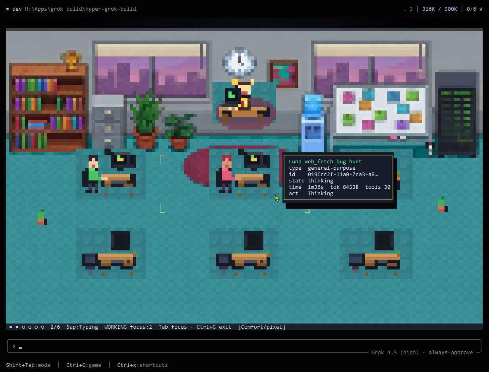

<div align="center">

<h1>Turbo Grok Build</h1>


<p>
  <a href="https://github.com/danmsheets-dev/turbo-grok-build/releases"></a>
  <a href="https://github.com/danmsheets-dev/turbo-grok-build/actions/workflows/release.yml"></a>
  <a href="LICENSE"></a>
  
  
  
  
</p>

**Turbo Grok Build** (CLI: **`turbo`**) is a heavily extended multi-agent coding
CLI forked from [xAI Grok Build](https://github.com/xai-org/grok-build). It keeps
the Rust TUI core and multi-provider stack, then layers production-grade
**folder worktrees**, recovery tooling, deep-audit workflows, Game Mode, field
logging, and agent orientation that the upstream product does not ship.

Current release line: **Grok Build 1.0 core** · wire **`1.0.0-rc.3`** — the
shipped Windows build (see [Prebuilt Windows binary](#prebuilt-windows-binary)).

CLI binary: **`turbo`** (installs to `~/.turbo/bin`). Product name: **Turbo Grok Build**.

[What changed](#what-makes-turbo-different) ·
[Feature overview](#feature-overview) ·
[RC history](#community-rc-history) ·
[Install](#installation) ·
[Providers](#providers) ·
[Subagents & worktrees](#subagents--worktrees) ·
[Workflows & deep audit](#workflows--deep-audit) ·
[Web fetch](#web-fetch) ·
[Auto Developer Log](#auto-developer-log) ·
[Build](#building-from-source) ·
[Docs](#documentation) ·
[License](#license)

</div>

---

## What makes Turbo different

Upstream Grok Build is a strong single-session coding agent. **Turbo Grok Build
is a multi-agent development runtime** built on that foundation.

| Area | Upstream Grok Build | **Turbo Grok Build** |
|------|---------------------|----------------------|
| Product focus | Official agent CLI | Community multi-agent platform |
| Subagents | Present | Isolation by default, land/diff/discard, soft-preserve, restore |
| Folder worktrees | Optional / fragile | Default `isolation=worktree`, FS confine, baseline agent-only patches |
| Worktree recovery | Ephemeral / hard to find | Snapshot + baseline refs + `turbo subagent …` CLI |
| Dirty-parent pollution | Diff vs HEAD can explode | Spawn **baseline** refs → agent-only patches; land fails closed if huge |
| Deep audit | — | **`/deepaudit`** recipe (investigate → verify → report) |
| Workflows | Limited | Rhai recipes + NL soft-match + boot-card routing |
| Web content | Search / raw HTTP | **`web_fetch`** URL → clean markdown (token-aware) |
| Agent orientation | System prompt + project rules | **Agent Boot Card** + Workspace Tree atlas |
| Product field signal | `/feedback`, crashes | **Auto Developer Log** + **Feature Request Log** |
| Providers | xAI-centric | Multi-provider (Grok, NVIDIA Integrate, Codex, Kimi, OpenAI, Anthropic, …) |
| UX | TUI | TUI + **Game Mode** (`Ctrl+G` pixel office) |
| Branding / binary | `grok` · `~/.grok` | Product **Turbo Grok Build** · CLI **`turbo`** · binary under `~/.turbo` |

### Prebuilt Windows binary

A production Windows build of **Turbo `1.0.0-rc.2.1`** is published as a **GitHub
Release asset** (≈143 MB — not stored as a regular git blob; public-fork LFS
uploads are blocked on GitHub):

| Wire | Release | Asset name |
| --- | --- | --- |
| `1.0.0-rc.2.1` | [v1.0.0-rc.2.1](https://github.com/danmsheets-dev/turbo-grok-build/releases/tag/v1.0.0-rc.2.1) | `turbo-1.0.0-rc.2.1-x86_64-pc-windows-msvc.exe` |
| `1.0.0-rc.1` | [v1.0.0-rc.1](https://github.com/danmsheets-dev/turbo-grok-build/releases/tag/v1.0.0-rc.1) | `turbo-1.0.0-rc.1-x86_64-pc-windows-msvc.exe` |

```powershell
# Download the asset from the release page, then:
Copy-Item .\turbo-1.0.0-rc.2.1-x86_64-pc-windows-msvc.exe $env:USERPROFILE\.turbo\bin\turbo.exe
# or: set GROK_BINARY to the downloaded path for the Grok Build Claude plugin
```

Packaging notes: [`releases/windows/README.md`](./releases/windows/README.md).

The prebuilt matches this tree at the `v1.0.0-rc.2.1` tag. Rebuild from source for
anything newer. Full notes: [`CHANGELOG.md`](./CHANGELOG.md).

### Highlights (1.0 line)

**1.0.0-rc.1** merges official **xAI Grok Build 1.0.0** as the permanent upstream
core while keeping Turbo’s product layer (worktrees, deep-audit, Game Mode,
multi-provider, English-only).

**1.0.0-rc.2** adds the **Agent WebView** — a product-owned WebView2 window the
agent drives through first-class `browser_*` tools, mirrored in the TUI with
`Ctrl+Shift+B` — plus the **Grok 4.6** default catalog, MCP disk-wins config
merge, full Disk Clean, and harness polish for the Grok Build Claude plugin
(identity card, permission aliases, job-object ergonomics). It also carries a
confinement hardening pass: a `--confine` write-boundary escape and a
snapshot-uid forgery vector were found and closed before release
([`docs/RC2_UNRELEASED_AUDIT.md`](./docs/RC2_UNRELEASED_AUDIT.md)).

**1.0.0-rc.2.1** is the Agent WebView hotfix. rc.2 shipped it with a named-pipe
defect that gave a fresh `browser_navigate` a four-in-five chance of never
returning, so the window opened and stayed white. That is fixed, along with the
field report it produced: a wedged host now returns a real error instead of a
transport timeout, first paint explains itself, the title carries the page host
and session, and the close button hides the window instead of killing the host.

Earlier community highlights (Game Mode, disk clean, tools list) from the
`0.2.119-rN` line remain in the product; see [`CHANGELOG.md`](./CHANGELOG.md).

- **Windows voice crash fixed (release blocker)** — `cpal`'s process-global WASAPI
  device enumerator outlived the COM apartment that created it, so the **second**
  push-to-talk dictation in a session hard-crashed the process (exit 139, no
  panic, unsent draft lost). Voice mode is on by default, so this was reachable
  by anyone dictating twice. All in-process `cpal` work now runs on one
  long-lived audio host thread
- **Game Mode overhaul** — hover tooltips on the **Supervisor** (model, phase,
  turn elapsed, context usage, seats, branch) and on the **MCP server rack**
  (per-server status, tool counts, failure detail, backed by a live status cache);
  eleven new sprite animations; and the office no longer pins the event loop at
  ~12 Hz while idle. Full audit: [`docs/RC2_GAME_MODE_AUDIT.md`](./docs/RC2_GAME_MODE_AUDIT.md)
- **Test suite** — `cargo check --workspace --all-targets` is clean and
  **28 414 tests pass** (`cargo test --workspace --lib` is fully green). Nine
  integration tests are known to fail on a developer machine that has real MCP
  servers, hooks, or auth configured — they read live user state instead of a
  fixture; see [`docs/RC2_UNRELEASED_AUDIT.md`](./docs/RC2_UNRELEASED_AUDIT.md).
  The `xai-grok-pager-pty-harness` crate is excluded: its ConPTY teardown can
  spin on Windows
- **Line endings made deterministic** — 34 files carried CRLF **in the git index**,
  so Windows and Linux builders shipped different bytes. Now a `.gitattributes`
  + a CI guard that *derives* the embedded-asset inventory rather than trusting a
  hand-written list
- **`turbo tools list [--require …]`** — prove `spawn_subagent` (and peers) are
  registered after config resolve; no model turn. Honors `GROK_SUBAGENTS=0`
- **`turbo disk report|check|clean --safe|recover|prune`** — multi-path free-space gate,
  category reclaim (`--include debug-pdbs|release|release-dist-caches|…`),
  JSON `reclaimed_bytes`, unified prune (RC3 full Disk Clean)
- **Keep-N + free gate defaults** — `GROK_SUBAGENT_KEEP_N=3` (age-only when `0`);
  `GROK_MIN_FREE_GB=40` fail-closed before isolation=worktree create
- **Agent cargo policy** — package-scoped tests, `CARGO_INCREMENTAL=0` one-shots,
  clean debug after ship builds (see [`AGENTS.md`](./AGENTS.md))

Three bugs were found only because the suite could finally run: Codex Live's
Windows speaker output was **silently dead** (the stream dropped the instant it
was created), Windows and macOS users were shown **Linux** paste instructions, and
`locales/en.yml` was compiled into the binary without an LF pin.

Still ships from earlier RCs: **`web_fetch`** + workflow routing (RC14), isolation
FS jail (RC12), Workspace Tree inject (RC13), Game Mode (RC11), baselines + Boot
Card + ADL (RC9–10), **`/deepaudit`** (RC8).

Not affiliated with xAI. Based on Apache-2.0 Grok Build source.

---

## Feature overview

| Feature | What it does | Since |
|---------|----------------|-------|
| **Folder worktrees** | Subagents default to isolated git worktrees under `~/.grok/worktrees/…` | RC7 (harden RC6–RC12) |
| **Land / diff / discard** | Promote or drop child work via tools + `turbo subagent …` | RC8–RC9 |
| **Agent-only baselines** | Diff/land = `baseline..snapshot`, not dirty parent vs HEAD | RC9 |
| **Soft-preserve + keep-N** | Live worktrees kept for review; `GROK_SUBAGENT_KEEP_N` (default 3; `0` = age-only) | RC9 / RC12 / RC2 |
| **Free-space gate** | Pre-spawn + `turbo disk check` (`GROK_MIN_FREE_GB`, default 40) | RC12 / RC2 |
| **`turbo tools list`** | Headless schema assert (`--require spawn_subagent`) without a model turn | RC2 |
| **`turbo disk`** | Report / check / category clean / recover / prune (multi-path free space) | RC15 / RC2 / **RC3** / **1.0-rc1** |
| **FS confine (worktree)** | Write path + shell operand jail fail closed | RC12 |
| **`/deepaudit`** | Parallel investigate → independent verify → verified report | RC8 |
| **`/deep-research`** | Bounded research with claim cross-check | earlier + RC14 routing |
| **Workflow tool + NL** | Rhai recipes; free-text maps to stock launches | RC14 |
| **`web_fetch`** | URL → clean text for the model (tokens down, content up) | RC14 |
| **Workspace Tree** | `workspace_tree` / `resolve_path` + session inject card | RC12–RC13 |
| **Agent Boot Card** | Ops brief: tools, isolation, recovery, logging, workflows | RC9 / RC14 |
| **Auto Developer Log** | Structured product issues (`developer_log` + `turbo issues`) | RC9 |
| **Feature Request Log** | Missing capability surface (`feature_request_log` + `turbo features`) | RC11 |
| **Game Mode** | `Ctrl+G` pixel office of supervisor + subagent desks; hover tooltips (Supervisor / MCP rack), 11 animations, parks when idle | RC11 / RC2 |
| **Multi-provider** | Grok, NVIDIA Integrate, Codex, Kimi, OpenAI, Anthropic, … | r2+ |
| **Headless honesty** | Streaming-json tool/subagent events, confine, trust gates | RC6 |

---

## Community RC history

| RC | Wire | Theme |
|----|------|--------|
| **r1–r5** | `0.2.114-r1` … `r5` | Community fork: providers, extensions, OMP resume, Linux glibc 2.17 floor |
| **r6** | `0.2.114-r6` | Isolation + headless honesty (confine is a boundary; isolation fails closed) |
| **r7** | `0.2.114-r7` | **Folder worktrees by default** (`isolation=worktree`) |
| **r8** | `0.2.114-r8` | **Deep audit**, land/diff/discard tools, NVIDIA harden, continuous-improve |
| **r9** | `0.2.114-r9` | Baselines, **Boot Card**, **Auto Developer Log**, soft-preserve |
| **r10** | `0.2.114-r10` | Deep-audit + ADL ship fixes; **Turbo** brand / `turbo` CLI |
| **r11** | `0.2.114-r11` | **Game Mode** + Feature Request Log |
| **r12** | `0.2.114-r12` | Isolation **FS jail**, densify lifecycle, MCP harden, Game Mode polish |
| **r13** | `0.2.114-r13` | **Workspace Tree** inject, densify engines, Game Mode performance |
| **r14** | `0.2.114-r14` | **`web_fetch`** + **workflow routing** |
| **r15** | `0.2.119-r1` | **Upstream 0.2.119 sync**, security + Windows correctness |
| **r2** | **`0.2.119-r2`** | **Windows voice-crash fix**, **Game Mode overhaul**, green suite, LF normalization, disk keep-N / free gate, **`turbo tools list`** |

> RC numbering follows the **wire version**, which restarted at `r1` when RC15
> synced upstream `0.2.119`. So the release after RC15 is **r2** (`0.2.119-r2`),
> not "r16".

Full per-release detail: [`CHANGELOG.md`](./CHANGELOG.md).

---

## Screenshots

| Welcome (English) | Game Mode |
| ----------------- | --------- |
|  |  |

---

## Names at a glance

| | Official | This project |
|---|---|---|
| Product | Grok Build | **Turbo Grok Build** |
| CLI binary | `grok` | **`turbo`** |
| Install root | `~/.grok` | **`~/.turbo`** (binary only) |
| Config / auth / sessions | `~/.grok` | **same `~/.grok`** (shared) |
| Release line | upstream cadence | **RC2** · `0.2.119-r2` |
| Upstream | [xai-org/grok-build](https://github.com/xai-org/grok-build) | This fork (+ multi-provider / multi-agent patches) |

GitHub repo: **`turbo-grok-build`**. Product name is **Turbo Grok Build**; CLI is **`turbo`**.

---

## Installation

Prebuilt binaries (macOS arm64/x86_64, Linux arm64/x86_64 glibc 2.17+, Windows x86_64) on
[GitHub Releases](https://github.com/danmsheets-dev/turbo-grok-build/releases):

```sh
# macOS / Linux
curl -fsSL https://raw.githubusercontent.com/danmsheets-dev/turbo-grok-build/dev/install.sh | bash
```

```powershell
# Windows PowerShell
irm https://raw.githubusercontent.com/danmsheets-dev/turbo-grok-build/dev/install.ps1 | iex
```

```sh
turbo --version
turbo login          # xAI / Grok session (browser OAuth)
turbo                # start the TUI
```

Pin a release:

```sh
curl -fsSL https://raw.githubusercontent.com/danmsheets-dev/turbo-grok-build/dev/install.sh | bash -s -- --version v0.2.119-r2
```

```powershell
# Windows — pin RC2
irm https://raw.githubusercontent.com/danmsheets-dev/turbo-grok-build/dev/install.ps1 | iex
# or from a clone after a release tag exists:
# .\install.ps1 -Version v0.2.119-r2
```

Installer verifies `SHA256SUMS`, installs to `~/.turbo/bin/turbo`
(`%USERPROFILE%\.turbo\bin\turbo.exe` on Windows).

> **Note:** Prebuilt install requires a published GitHub Release for
> `v0.2.119-r2`. Until then, [build from source](#building-from-source) and copy
> `target/release-dist/turbo` into `~/.turbo/bin`.  
> Repo: [danmsheets-dev/turbo-grok-build](https://github.com/danmsheets-dev/turbo-grok-build).

### Install with Nix

```sh
nix run github:danmsheets-dev/turbo-grok-build#turbo-grok-build -- --version
nix profile install github:danmsheets-dev/turbo-grok-build#turbo-grok-build
```

From a clone:

```sh
git clone https://github.com/danmsheets-dev/turbo-grok-build
cd turbo-grok-build
nix run .#turbo-grok-build -- --version
nix develop
```

---

## Providers

| Platform | Auth | Notes |
| -------- | ---- | ----- |
| xAI / Grok | `turbo login` or `XAI_API_KEY` | First-party models |
| NVIDIA Integrate | platform key | Large catalog; Turbo adds agent-ready hardening |
| Kimi Code / Moonshot | OAuth / API key | `kimi-code/*`, open platform |
| ChatGPT Codex | ChatGPT OAuth | GPT-5.x + experimental live voice |
| OpenCode Go | subscription key | Chat Completions + Messages |
| OpenAI / Anthropic / DeepSeek-style | BYOK | Catalog platforms |
| Z.AI Coding Plan | platform key | International plan |
| Ollama Cloud | API key | Live roster sync |

Model ids look like `{platform}/{model}`. Config and credentials stay under
**`~/.grok`** (shared with upstream Grok Build).

---

## Subagents & worktrees

Turbo treats subagents as first-class workers with **folder worktrees** and
recovery (isolation-by-default since **RC7**, fail-closed + FS confine through
**RC12**):

```text
spawn (isolation=worktree)
  → spawn baseline  refs/grok/subagent-baselines/<id>
  → agent works in ~/.grok/worktrees/<slug>/subagent-<id>
  → complete snapshot refs/grok/subagents/<id>
  → soft-preserve live tree (or clean if GROK_SUBAGENT_SOFT_PRESERVE=0)
  → agent-only patch: baseline..snapshot
```

```bash
turbo subagent list
turbo subagent open <id>
turbo subagent open <id> --restore          # materialize snapshot
turbo subagent diff <id>
turbo subagent land <id>                    # refuses huge dirty-tree patches
turbo subagent discard <id>
```

Optional:

| Env | Effect |
|-----|--------|
| `GROK_SUBAGENT_SOFT_PRESERVE=0` | Delete live tree immediately after snapshot |
| `GROK_SUBAGENT_KEEP_N` | Max soft-preserved live trees (default **3**; `0` = age-only). Alias: `GROK_SUBAGENT_SOFT_PRESERVE_KEEP_N` |
| `GROK_SUBAGENT_KEEP_MAX_AGE_SECS` | Age cutoff when `KEEP_N=0` (default 86400 = 24h) |
| `GROK_MIN_FREE_GB` | Free-space floor before worktree create / `turbo disk check` (default **40**; `0` disables). Alias: `GROK_SUBAGENT_MIN_FREE_BYTES` |
| `GROK_SUBAGENT_WORKTREE_SEED=clean` | HEAD-only sandbox (default; no parent dirty copy). Completion tag: `<worktree_seed>clean</worktree_seed>` |
| `GROK_SUBAGENT_WORKTREE_SEED=dirty` | Copy parent WIP into the worktree (preserve working tree) |
| `GROK_POST_SUBAGENT_DISK_CLEAN=off` | Disable auto `disk clean --safe --if-low-space` after subagent dispose (default: enabled, 5‑min debounce) |
| `GROK_PREFER_GIT_BASH_FOR_SCRIPTS=0` | Windows: do not rewrite bare `bash` / `*.sh` to Git Bash |
| `retain_worktree=true` on spawn | Keep path until land/discard |

Headless schema assert (no model turn):

```bash
turbo tools list
turbo tools list --require spawn_subagent --json
turbo disk check            # exit 1 if free space under GROK_MIN_FREE_GB
turbo disk report           # shows keep-N + min-free threshold status
turbo disk recover --safe   # check → clean --if-low-space → re-check
turbo tree prune --execute  # apply tree-store prune (default is dry-run)
```

Details: [`docs/KNOWN_ISSUES.md`](docs/KNOWN_ISSUES.md),
[`CHANGELOG.md`](./CHANGELOG.md) (RC7–RC2), user-guide `16-subagents.md`.

---

## Workflows & deep audit

Stock Rhai workflows (background; progress in `/workflows`):

| Recipe | Slash / NL | What it does |
|--------|------------|--------------|
| **deep-audit** | `/deepaudit`, `/deep-audit`, `/ultracode` · “run a deep audit on …” | Parallel find → independent verify → verified-only report (read-only) |
| **deep-research** | `/deep-research <query>` · “deep-research on …” | Bounded research shards + claim cross-check + citations |
| **continuous-improve** | `/workflow continuous-improve` | Research → plan → implement (worktree) → verify loop |

Agents with the `workflow` tool are instructed (Boot Card + system prompt) to
**launch these recipes** instead of spawning two ad-hoc explore/review
subagents. Host soft-match also intercepts clear free-text audit/research
requests when workflows are enabled (`GROK_WORKFLOWS=0` to disable).

```text
/deepaudit --size medium crates/codegen/xai-grok-tools
Can you run a deep audit on the security app
/deep-research Compare Postgres 17 vs MySQL 9 migration risks
```

User/project recipes: `~/.grok/workflows/*.rhai` and `.grok/workflows/*.rhai`
(filename should match `meta.name`).

---

## Web fetch

**`web_fetch`** turns a URL into **agent-usable clean text** (HTML → markdown,
article extract, windowing) with SSRF protection, DNS pin on direct egress,
challenge detection, and token-aware defaults (links off by default).

```text
# Agent tool (when enabled — default on)
web_fetch url=https://example.com/docs extract_mode=article
```

Disable: `GROK_WEB_FETCH=0` or `[features] web_fetch = false`. Optional
enterprise allowlist: `[toolset.web_fetch] allowed_domains = […]`. See user
guide configuration and [`CHANGELOG.md`](./CHANGELOG.md) RC14.

---

## Auto Developer Log

Agents are instructed (Boot Card) to **always** file product friction with the
`developer_log` tool. Humans triage with:

```bash
turbo issues list
turbo issues show <id>
turbo issues export --severity p0 --out ./turbo-issues-pack
turbo issues path
turbo issues set-dir D:/TurboLogs/developer-log   # persist custom root
turbo issues clear-dir
```

| Precedence | Log directory source |
|------------|----------------------|
| 1 | `turbo issues set-dir` (session + `~/.grok/developer-log.toml`) |
| 2 | `GROK_DEVELOPER_LOG_DIR` |
| 3 | `~/.grok/developer-log.toml` |
| 4 | Default `~/.grok/developer-log` |

Disable: `GROK_DEVELOPER_LOG=0`. Full writeup: [`docs/AUTO_DEVELOPER_LOG.md`](docs/AUTO_DEVELOPER_LOG.md).

---

## Agent Boot Card

On each **new** session (and by default on resume), Turbo injects a short system
briefing (`<turbo_boot_card>`) covering tools, **workflows catalog**, subagent
lifecycle, recovery commands, land safety, and **required** `developer_log` /
`feature_request_log` usage. Subagents get a tiny child stub only.

```text
GROK_BOOT_CARD=off|short|full    # default short
GROK_BOOT_CARD_ON_RESUME=0       # disable inject on resume
```

Workspace Tree inject (RC13) adds a budgeted `<workspace_tree_card>` atlas after
the boot card when indexing is enabled.

---

## Game Mode

`Ctrl+G` opens a pixel **office** view of the Supervisor (main agent) and
subagent desks (added **RC11**, polished RC12–RC13, overhauled **RC2**). Chat
composer stays available. Compact terminals fall back to a simpler layout. Tasks
pane: `Ctrl+Shift+G`.

**Hover tooltips (RC2).** Hover the **Supervisor** for model, phase, turn elapsed,
context window used/total, seat + overflow counts and git branch. Hover the **MCP
server rack** for per-server status, tool counts and failure detail — backed by a
live status cache, so it stays current outside the `/mcps` modal. `Tab` /
`Shift+Tab` cycle desks; `Esc` clears.

**Animations (RC2).** Eleven added: debug-rage pose on failure, arms-up celebrate
with confetti, papers flying during handoff, monitor glow + compile flash, a door
that swings on spawn/exit, MCP rack LEDs bursting on **real tool calls**,
coffee-sip idle, a real day/night wall clock, an office-wide success wave, typing
cadence driven by token throughput, and a floor robot that patrols only while the
office is busy.

**Idle cost (RC2).** An open office used to wake the event loop ~12×/sec forever.
A frozen room now parks — Compact and Unicode tiers at zero wakeups, the pixel
office at a budgeted ~0.33 Hz ambient tick that drives the idle animations.
Closing the view now also releases ~8–10 MB of image caches that previously
leaked for the life of the process.


---

## Building from source

Requirements: Rust (`rust-toolchain.toml`), [DotSlash](https://dotslash-cli.com)
for `bin/protoc`, CMake 3.5+.

```sh
cargo run -p xai-grok-pager-bin              # TUI (binary name: turbo)
GROK_VERSION=$(cat VERSION) cargo build -p xai-grok-pager-bin --profile release-dist
./target/release-dist/turbo --version
```

Windows PowerShell:

```powershell
$env:GROK_VERSION = (Get-Content VERSION -Raw).Trim()
cargo build -p xai-grok-pager-bin --profile release-dist --bin turbo
# Binary: target\release-dist\turbo.exe  (do not install over ~/.turbo until ready)
```

Community branding / updater: `--features community-build` (default on this tree).

### Disk hygiene (important on Windows)

This monorepo’s `target/` can grow past **100–200 GB** (debug incremental + PDBs,
plus independent `release-dist` caches). Prefer package-scoped `cargo check` /
`cargo test`. Before large builds, free space should be ≥40 GB (see
[`AGENTS.md`](./AGENTS.md)). After a successful ship binary:

```powershell
# Keep turbo.exe; drop release-dist rebuild caches (optional)
Remove-Item -Recurse -Force target\debug -ErrorAction SilentlyContinue
# Or only: target\release-dist\{incremental,deps,build,.fingerprint}
```

`turbo disk report|check|clean --safe` shipped in **RC2** — see
[`CHANGELOG.md`](./CHANGELOG.md).

---

## Changelog & known issues

- [`CHANGELOG.md`](./CHANGELOG.md) — **official changelog** · **RC14** (`0.2.114-r14`) is current
- [`docs/KNOWN_ISSUES.md`](./docs/KNOWN_ISSUES.md)
- [`docs/workspace-tree.md`](docs/workspace-tree.md) — Workspace Tree (RC12–RC13)
- [`docs/archive/RC11_RELEASE_NOTES.md`](docs/archive/RC11_RELEASE_NOTES.md) — Game Mode (historical)
- [`docs/archive/RC9_FEATURES.md`](docs/archive/RC9_FEATURES.md) — worktrees, Boot Card, ADL (historical)
- [`docs/archive/Q&A/rc9/RC10_HARNESS_FIX_PLAN.md`](docs/archive/Q&A/rc9/RC10_HARNESS_FIX_PLAN.md) — RC10 harness matrix (historical)

---

## Releasing

1. Set root [`VERSION`](VERSION) to the monorepo lockstep client version (stamp
   `x-grok-client-version`; xAI rejects clients below **0.1.202**).
2. Update `CHANGELOG.md`, commit on `dev`.
3. Tag and push:

```sh
VERSION=$(tr -d '[:space:]' < VERSION)
git tag "v${VERSION}"
git push origin "v${VERSION}"
```

Workflow: [`.github/workflows/release.yml`](.github/workflows/release.yml).
Artifacts ship as `turbo-<version>-<target>.tar.gz` / `.zip` + `SHA256SUMS`.

---

## Coexistence with official `grok`

| Surface | Official | Turbo (`turbo`) |
|---------|----------|-----------------|
| Binary | `grok` | `turbo` |
| Install root | `~/.grok/bin` | `~/.turbo/bin` |
| Config / auth / sessions | `~/.grok` | **same** |
| Leader IPC | under `~/.grok` | **same namespace** |

- Sessions and OAuth are shared — log in once for both.
- Updater is isolated: Turbo never overwrites `~/.grok/bin/grok`.
- Not affiliated with xAI / SpaceXAI.

---

## Documentation

| Doc | Content |
|-----|---------|
| [User guide](crates/codegen/xai-grok-pager/docs/user-guide/) | Product how-to (CLI is `turbo`) |
| [Changelog](./CHANGELOG.md) | RC14 + pedigree table |
| [Workspace Tree](docs/workspace-tree.md) | Atlas / inject / CLI |
| [Auto Developer Log](docs/AUTO_DEVELOPER_LOG.md) | Field logging for maintainers |
| [Feature Request Log](docs/FEATURE_REQUEST_LOG.md) | Missing-capability log |
| [Archive](docs/archive/) | Historical RC plans / Q&A (not product surface) |
| Official Grok Build | [docs.x.ai/build](https://docs.x.ai/build/overview) |

`SOURCE_REV` records the last monorepo sync point.

### Tracking remotes (for cherry-picks / Turbo vs Hyper compare)

| Remote | URL | Use |
|--------|-----|-----|
| `origin` | `danmsheets-dev/turbo-grok-build` | This Turbo fork (`dev` default) |
| `upstream` | `xai-org/grok-build` | Official Grok Build (fetch-only) |
| `community` | `DaviRain-Su/hyper-grok-build` | Hyper community (fetch-only) |

Turbo and Hyper share a common history but diverge after the rebrand. Use
fetch + log for compare; do not merge casually.

**Last sync: RC15 (`0.2.119-r1`).** Turbo merged xAI upstream `e5478eff1`
(0.2.119, `SOURCE_REV` `27d2088ae…`) in full and cherry-picked a set of Hyper
fixes on top. The Turbo/Hyper fork point is `c260695cc` (2026-07-29); Hyper was
compared at `7a48dd755`. Anything already listed in the RC15 changelog under
"Deliberately NOT taken" was evaluated and declined — re-read that before
proposing it again. Note that two Hyper fixes Turbo carries (the circuit-breaker
probe race and the `auth.json` scope-lock question) exist **only inside Hyper's
merge commits**, so a `--no-merges` log will not show them; use
`git show --cc <merge>` when surveying.

```sh
git fetch origin
git fetch upstream
git fetch community
# Inspect without merging:
git log --oneline HEAD..community/dev | head
git log --oneline community/dev..HEAD | head
git rev-list --count HEAD..community/dev   # commits Hyper has that Turbo lacks
git rev-list --count community/dev..HEAD   # commits Turbo has that Hyper lacks
git show community/dev:VERSION
git show HEAD:VERSION
```

---

## Repository layout

| Path | Contents |
|------|----------|
| `crates/codegen/xai-grok-pager-bin` | Composition root → `turbo` binary |
| `crates/codegen/xai-grok-pager` | TUI |
| `crates/codegen/xai-grok-shell` | Agent runtime / subagents |
| `crates/codegen/xai-grok-developer-log` | Auto Developer Log store |
| `crates/codegen/xai-grok-agent` | Prompt assembly / Boot Card |
| `install.sh` / `install.ps1` | Release installers |
| `.github/workflows/release.yml` | Multi-target release CI |

> [!IMPORTANT]
> Root `Cargo.toml` is often treated as monorepo-generated — prefer editing
> per-crate manifests for durable local changes.

---

## License

Apache-2.0. See [`LICENSE`](LICENSE), [`NOTICE`](NOTICE), and
[`THIRD-PARTY-NOTICES`](THIRD-PARTY-NOTICES).

Based on [xai-org/grok-build](https://github.com/xai-org/grok-build).
**Turbo Grok Build** is an independent community fork — not an official xAI product.
